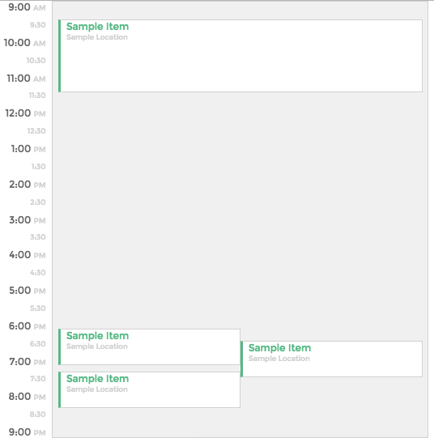

# Day View Calendar
- Built with vanilla javascript, html, css

## Overview


- Events are stored in an array of objects with a start and end time
- getCollisions iterates through events and tells you which events are in each 30min slot
- getAttributes gets you the width and positioning of each event (event collisions are handled with no overlap)

## Usage

```sh
open index.html
to run new set of events, run layOutDay(generateMockEvents(n), where n is the number of events you want to render;